# SURF CENTER & SHOP
## Surf Center is an online e commerce project, build using Python, Django, HTML5, CSS, JavaScript, Amazon S3 and Stripe.
## [Link to the deployed application](https://surf-center-and-shop-5e23c52a2d1d.herokuapp.com/)

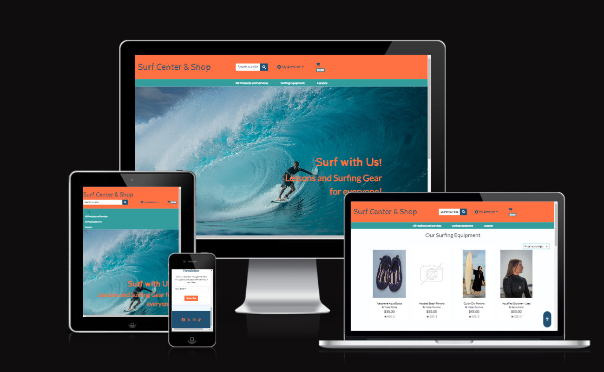

## CONTENTS
---
* [USER EXPERIENCE](#user-exp)  

    *  [Wireframes](#wireframes)

    *  [Kanban Board](#kanban-board)  


* [DESIGN](#design)  

    * [Colour Scheme](#colour-scheme)  
    * [Database schema](#database)  

* [FEATURES](#features)

    * [Features to implement](#features-to-implement)

* [TECHNOLOGIES USED](#technologies-used)  

    * [Languages and Libraries Used](#languages-libraries-used)
    * [Frameworks and Programes Used](#frameworks-programs) 

* [TESTING](TESTING.md)  

* [DEPLOYMENT AND LOCAL DEVELOPMENT](#deployment-development) 

    * [Deployment](#deployment)  

    * [Local Development](#local-development)  

        * [How To Fork](#how-to-fork)
        * [How To Clone](#how-to-clone)
        * [Using GitPod](#using-gitpod)


* [CREDITS](#Credits) 

    * [Code Used](#Code-Used)
    * [Acknowledgments](#Acknowledgments) 


## USER EXPERIENCE (UX)<a id = "user-exp"></a> 

* Wireframes <a id = "wireframes"></a>

    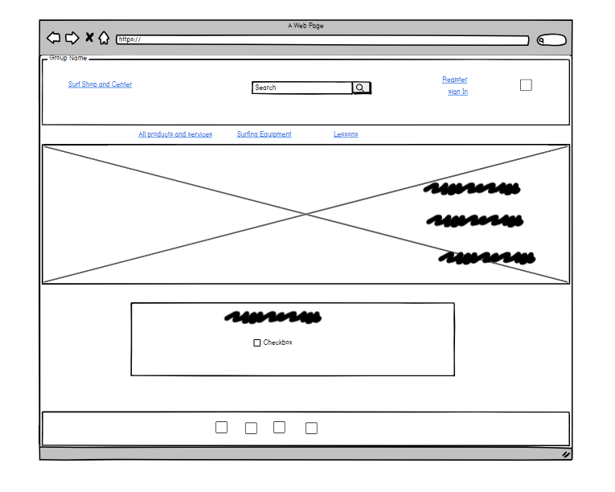
    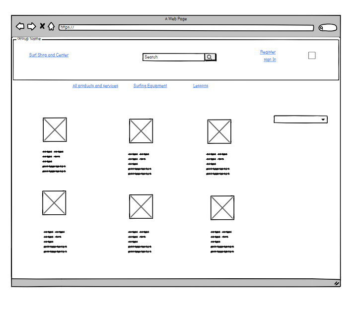

    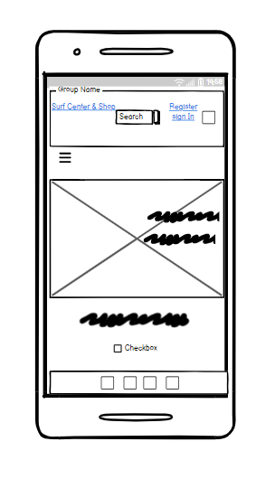
    
* Kanban Board <a id = "kanban-board"></a>
    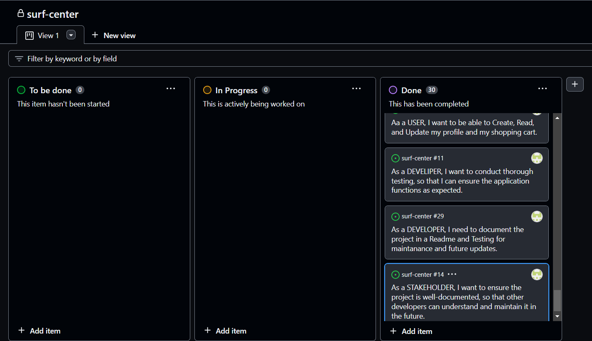

## Epics

### Epic 1: Project Setup and Environment Configuration
- **User Story**: As a DEVELOPER, I want to set up a version-controlled project environment, so that I can manage changes and collaborate effectively.
  - **Tasks**:
    - Set up a virtual environment.
    - Install essential dependencies.

- **User Story**: As a DEVELOPER, I need to set up the initial Django project and app to start development.
  - **Tasks**:
    - Initialize Django project.
    - Create Django App.

### Epic 2: Base Template and Front-end Foundations
- **User Story**: As a DEVELOPER I want to have a base template to extend it to other parts of the project.
  - **Tasks**:
    - Create a `base.html`.
    - Add necessary meta tags, Bootstrap, JavaScript tags, Font Awesome, blocks, Google Fonts.
    - Design header, navbar, and footer.

### Epic 3: Bug Management and Fixing
- **User Story**: As a DEVELOPER, I need to identify and fix bugs and document bugs that are not fixed for a smooth user experience.
  - **Tasks**:
    - Bug fixing.
    - Documenting known bugs.
    - Specific fixes for checkout bag, lessons, checkout success page.

### Epic 4: Database Setup and Management
- **User Story**: As a DEVELOPER, I need to create Django models to represent products and services.
  - **Tasks**:
    - Design product, service, and customer models.

- **User Story**: As a DEVELOPER, I need to connect the project to a database and deploy it.
  - **Tasks**:
    - Connect to ElephantSQL.
    - Upload Fixtures.
    - Connect to AWS.
    - Deploy to Heroku.
    - Turn off DEBUG mode and test.

- **User Story**: As a DEVELOPER, I need to configure the database to save my data.
  - **Tasks**:
    - Set up ElephantSQL.
    - Integrate database with Django.

- **User Story**: As a DEVELOPER, I need to implement CRUD operations for products to manage inventory.
  - **Tasks**:
    - Implement CRUD operations in Django admin.

### Epic 5: User Interaction and Experience
- **User Story**: As a MARKETER, I want visitors to sign up for the newsletter to keep them engaged.
  - **Tasks**:
    - Add newsletter sign-up form.

- **User Story**: As a CUSTOMER, I want a website that is easy to navigate and accessible.

- **User Story**: As a CUSTOMER, I want to view products to make purchase decisions.

- **User Story**: As a CUSTOMER, I want the website to be responsive on mobile devices.
  - **Tasks**:
    - Implement mobile responsiveness.

- **User Story**: As a CUSTOMER, I want to securely pay for my purchases online.
  - **Tasks**:
    - Integrate Stripe for payments.
    - Implement payment processing.

- **User Story**: As a CUSTOMER, I want the online store to reflect updates and changes immediately.

- **User Story**: As a CUSTOMER, I want to be able to update my personal information.
  - **Tasks**:
    - Implement functionality for customers to update their profile info.

### Epic 6: Marketing and Visibility
- **User Story**: As a MARKETER, I want to showcase products and services on social media for increased visibility.
  - **Tasks**:
    - Create a dummy social media product page and document it.

### Epic 7: Security and Reliability
- **User Story**: As a USER, I want to use a secure and reliable application.

### Epic 8: Search Engine Optimization
- **User Story**: As a potential CUSTOMER, I want to find the website through search engines.
  - **Tasks**:
    - Add robots.txt file.
    - Add meta tags.
    - Conduct SEO testing.

### Epic 9: Admin and User Account Management
- **User Story**: As an ADMIN, I want to add, edit, and delete product listings.

- **User Story**: As an ADMIN, I need the ability to manage customer accounts.
  - **Tasks**:
    - Implement admin capabilities for CRUD operations on customer accounts.

- **User Story**: As an ADMIN, I want to add, update, and delete records from the database without accessing the admin panel.
  - **Tasks**:
    - Add, edit, update, delete products and services.

- **User Story**: As a USER, I want to register, login, logout, and manage my account.
  - **Tasks**:
    - Implement registration, login, logout, password recovery.

- **User Story**: As a USER, I want to be able to Create, Read, and Update my profile and my shopping cart.
  - **Tasks**:
    - Create, Read, Update Profile.

### Epic 10: Testing and Documentation
- **User Story**: As a DEVELOPER, I want to conduct thorough testing.
  - **Tasks**:
    - Test across different devices and browsers.

- **User Story**: As a DEVELOPER, I need to document the project in a README.
  - **Tasks**:
    - Create a README.md.
    - Create Testing documentation.

- **User Story**: As a STAKEHOLDER, I want to ensure the project is well

---
 ## DESIGN<a id = "design"></a> 
 ---
 ### Colour Scheme<a id = "colour-scheme"></a> 

 The primary colour scheme used was defined on coolors

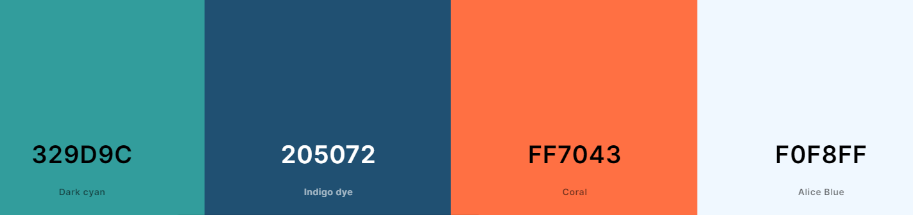

The secondary color scheme used throught the project: 

- `#329D9C`: This teal color is used in navigation and buttons.
- `#333333` (Dark Gray): Used mainly for text, providing good readability against lighter backgrounds.
- `#ffffff` (White): Mainly used for text against darker backgrounds, ensuring high contrast and readability.
- `#e06343`: A slightly different shade of orange used for hover effects, providing a subtle visual feedback to the user.
- `#cccccc` (Light Gray): Used for borders and inputs, offering a neutral tone that doesn't compete with the primary and other secondary colors.
---

## The Datbase Schema<a id = "database"></a>

### Category Model
- **Fields:**
  - `name`: CharField (max_length=254)
  - `display_name`: CharField (max_length=254, null=True, blank=True)
- **Methods:**
  - `__str__`: Returns the category name.
  - `get_friendly_name`: Returns the display name.

### Product Model
- **Relationships:**
  - Linked to `Category` through a ForeignKey.
- **Fields:**
  - `sku`: CharField (max_length=254, null=True, blank=True)
  - `name`: CharField (max_length=254)
  - `description`: TextField
  - `has_sizes`: BooleanField (default=False, null=True, blank=True)
  - `price`: DecimalField (max_digits=6, decimal_places=2)
  - `rating`: DecimalField (max_digits=6, decimal_places=2, null=True, blank=True)
  - `image_url`: URLField (max_length=1024, null=True, blank=True)
  - `image`: ImageField (null=True, blank=True)
  - `is_special_offer`: BooleanField (default=False, verbose_name="Special Offer")
- **Methods:**
  - `__str__`: Returns the product name.

### Service Model
- **Relationships:**
  - Linked to `Category` through a ForeignKey.
- **Fields:**
  - `type`: CharField (max_length=10, choices=LESSON_TYPES, default=GROUP)
  - `price`: DecimalField (max_digits=6, decimal_places=2, null=True, blank=True)
  - `image`: ImageField (null=True, blank=True)
  - `max_participants`: PositiveIntegerField (default=1)
  - `description`: TextField
  - `is_special_offer`: BooleanField (default=False, verbose_name="Special Offer")
- **Special Attributes:**
  - `LESSON_TYPES`: Tuple defining types of lessons (Private, Group)

### LessonSchedule Model
- **Relationships:**
  - Linked to `Service` through a ForeignKey.
- **Fields:**
  - `date`: DateField
  - `time_slot`: CharField (max_length=5, choices=TIME_SLOTS)
  - `is_booked`: BooleanField (default=True)
- **Methods:**
  - `__str__`: Returns formatted string of the lesson schedule.
- **Special Attributes:**
  - `TIME_SLOTS`: Tuple defining available time slots.

### Subscriber Model
- **Fields:**
  - `email`: EmailField (max_length=254, unique=True)
  - `date_subscribed`: DateTimeField (auto_now_add=True)
- **Methods:**
  - `__str__`: Returns the subscriber's email.

 ---
 ## THE FEATURES<a id = "features"></a> 
--- 
 * The Application consist of following pages- Home- Index page, Online Shop, Product Managmen, Profile Page, Sign Up Page, Sign In Page, Sign Out Confirmation, Error Pages.

 Main Features on the Index Page:

*  Header

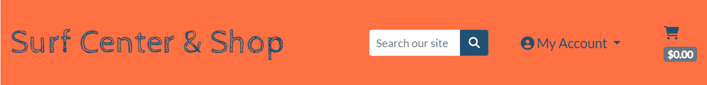

* Navigation Bar


* Hero Image


* Newsletter

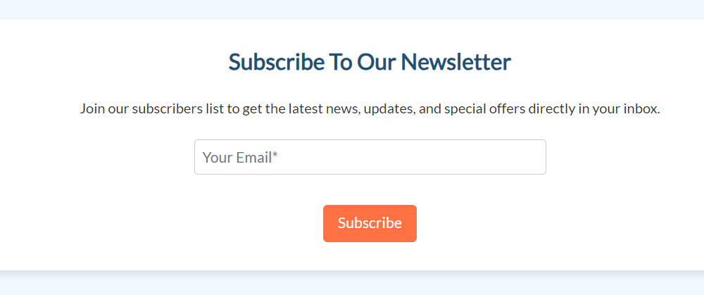

* Footer with Social Media Icons


    
Main Features on the online shop page :

* Products dispay

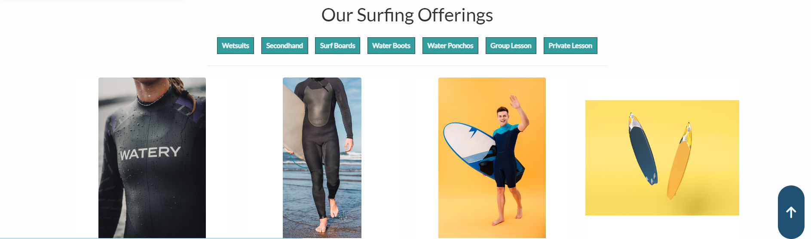

* Filtering by Category
    
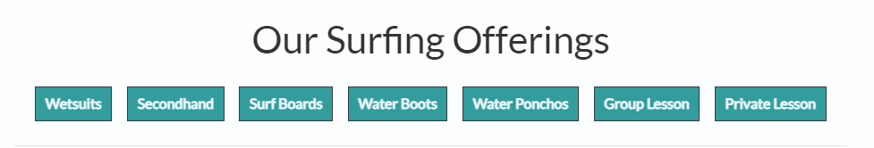

* Shopping Bag 

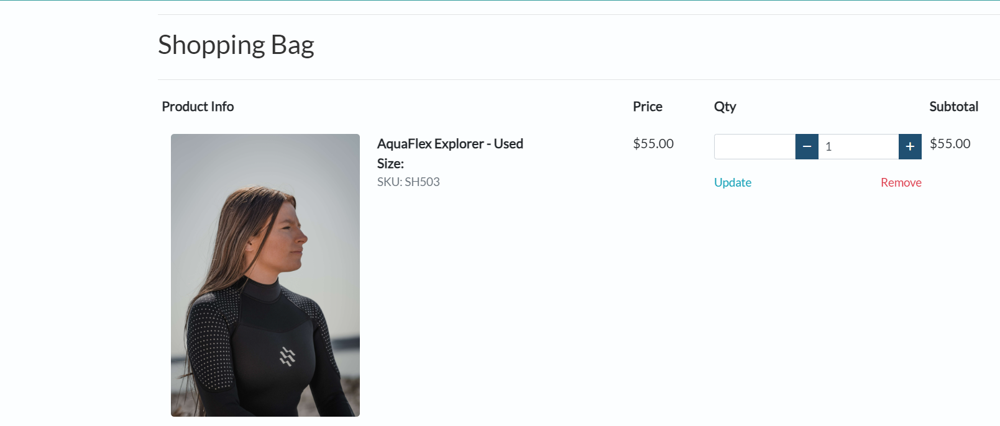

* Order Confirmation

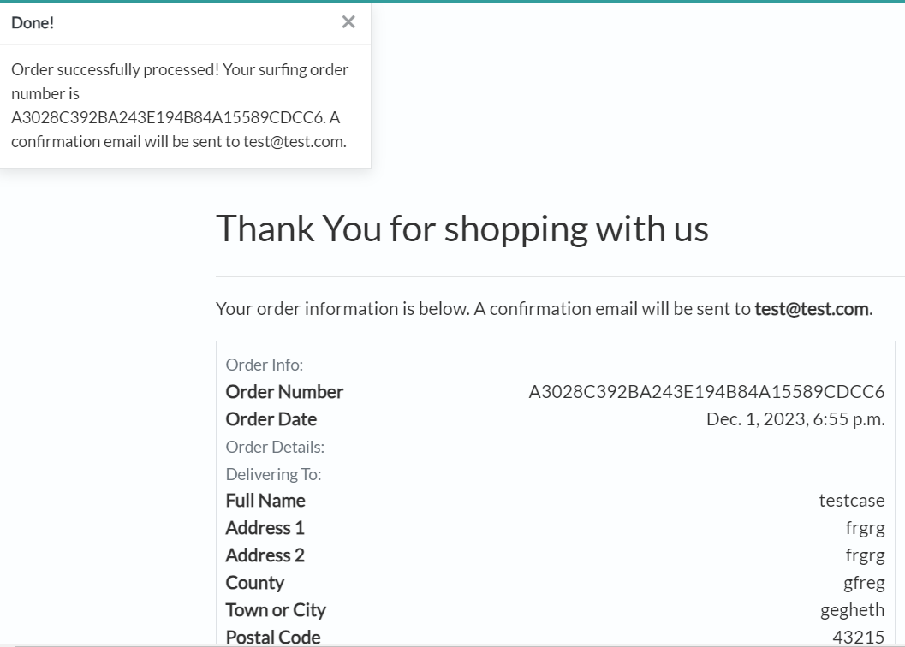

Product Managment Features :

* Product Managment
    
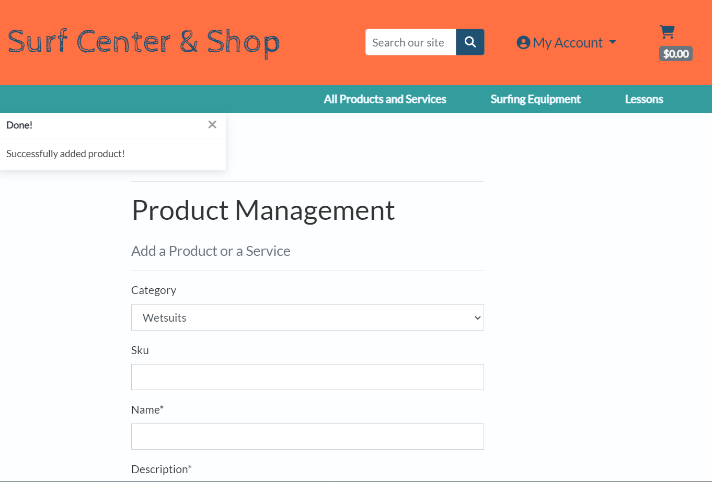

* Editing Product
    
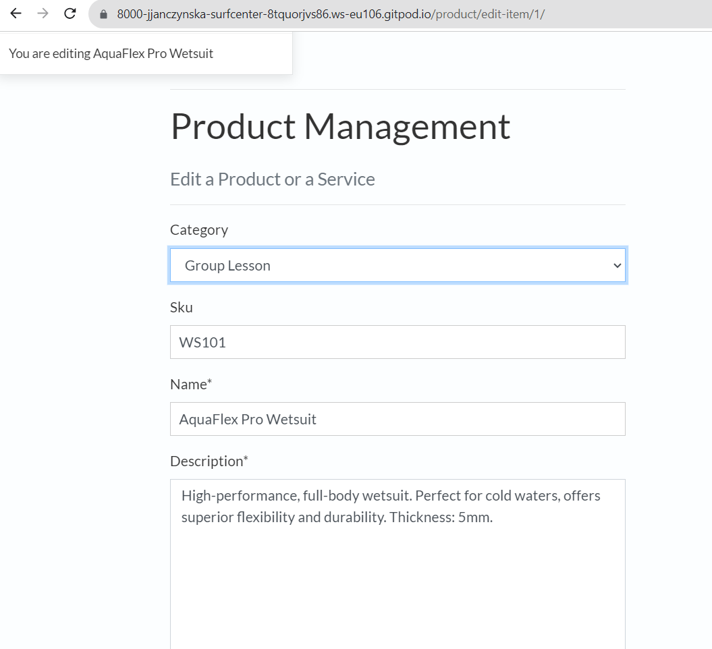

    

---
### Features to implement<a id = "features-to-implement"></a> 
* Discout Coupons
* Develop a recommendation system that suggests products based on user's browsing history and preferences.
* Implement real-time inventory tracking to update product availability.
* Notify customers when a product is back in stock.
* Enable customers to create and manage wishlists.
* Introduce a loyalty program to reward repeat customers.

---
## TECHNOLOGIES USED<a id = "technologies-used"></a> 
---
### Languages and Libraries Used<a id = "languages-libraries-used"></a> 

* [Django](https://www.djangoproject.com/) 
* [Bootstrap](https://getbootstrap.com/docs/4.0/getting-started/introduction/) 
* [HTML5](https://html.com/html5/) 
* [CSS](https://developer.mozilla.org/en-US/docs/Web/CSSS) 
* [jQuery](https://jquery.com/) 

Additional: 
- Pillow - Pillow is a Python Imaging Library (PIL) fork that provides tools for working with images in various formats.
- psycopg2 - Psycopg2 is a PostgreSQL adapter for Python. It allows Django to connect to PostgreSQL databases.
- Boto3 is the Amazon Web Services (AWS) SDK for Python. It allows to interact with AWS services, such as S3
- dj-database-url - This library is used to parse the database URL specified in the DATABASE_URL environment variable, which is commonly used for configuring database connections in Django projects.

### Frameworks and Programs Used<a id = "frameworks-programs"></a>  

* [Git](https://git-scm.com/) - for version control. 
* [GitHub](https://github.com/) - to store the project files.
* [GitPod](https://www.gitpod.io/) - as the CDE for development.
* [Heroku](heroku.com) - was used to deploy the progect.
* [Lucidchart](https://www.lucidchart.com/) - to create the flow chart and database schema.
* [Google Fonts](https://fonts.google.com/) - used for Roboto and Prompt fonts.
* [Font Awesome](https://fontawesome.com/) - used for social media icons.
* [Balsamiq](https://balsamiq.cloud/) - used to create wireframes.
* [Gunicorn](https://docs.djangoproject.com/en/4.2/howto/deployment/wsgi/gunicorn/) - used as the Web Server to run Django on Heroku.
* [Google Chrome Developer Tools](https://developer.chrome.com/docs/devtools/overview/) was used during testing, debugging and making the website responsive.
* [AWS](https://aws.amazon.com/) was used to store media files.
* [Stripe](https://stripe.com/en-ie) was integrated to handle payment processing in a secure and convenient way.
* [pscopg2](https://pypi.org/project/psycopg2/) - used as a database adapter to support the connection to database
* [Django allauth](https://django-allauth.readthedocs.io/en/latest/) - used for accounts registeration and authentication
* [Django crispy forms](https://django-crispy-forms.readthedocs.io/en/latest/) - used to simplyfy form rendering
* [Coolors.co](https://coolors.co/) was used to display the colour schem
---
## [TESTING](TESTING.md)

Results of the testing of the programe are available in another file. You can visit is by clicking on a link above.
---
## DEPLOYMENT AND LOCAL DEVELOPMENT<a id = "deployment-development"></a> 
---
### Deployment<a id = "deployment"></a> 

Before deploying, make sure your requirements.txt is updated 

#### Stripe setup
1. Log in to [Stripe](https://stripe.com/en-ie)
1. Navigate to developers section (link located at the top right)
1. Go to API keys tab and copy the values of PUBLIC_KEY and SECRET_KEY and add them to your env.py file
1. Navigate to the Webhooks page from the tab in the menu at the top and click on add endpoint.
1. This section requires a link to the deployed application. The link should look like this https://your_website.herokuapp.com/checkout/wh/ 
1. Choose the events the webhook should recieve and add endpoint.
1. When the application is deployed, run a test transaction to ensure the webhooks are working. The events chan be checked in the webhooks page.

#### This project was deployed in Heroku and the steps to deploy are:
1. Create an account and login to Heroku.
1. On the dashboard, click the button NEW --> to create a new app on the right side of the webpage.
1. Choose a name for the app and choose your region. Click --> Create app.
1. Go to the Settings tab, Scroll down to the Config Vars. Add key PORT and value of 8000.
1. Create Postgress DB on Heroku.
1. Configure Cloudinary to host images on application.
1. Go to Deploy tab, Select GitHub as Deployment Method and connect your account.
1. Enter the name of your respository and connect.
1. Select the Branch and click- Connect Branch.

#### Setting Up and Connecting to AWS :
- Log in to [AWS](https://aws.amazon.com/)
1. Create a new S3 bucket:
- Choose the closest AWS region.
- Add unique bucket name.
- Under Object Ownership select ACLs enabled to allow access to the objects in the bucket.
- Under Block Public Access settings unselect block all public access as the application will need access to the objects in the bucket.
- Click on create bucket.
2. Edit bucket settings.
- Bucket properties
  - Open the bucket page.
  - Go to properties tab and scroll down to website hosting and click on edit.
  - Enable static website hosting
  - Under the Hosting type section ensure Host a static website is selected.
  - Add Index.html to index document field and error.html to error document field and click save.
- Bucket permissions
    - Navigate and Click on the "Permissions" tab.
    - Scroll down to the "CORS configuration" section and click edit.
    - Enter the following snippet into the text box and click on save changes.

    ```
    [
    {
        "AllowedHeaders": [
            "Authorization"
        ],
        "AllowedMethods": [
            "GET"
        ],
        "AllowedOrigins": [
            "*"
        ],
        "ExposeHeaders": []
    }
    ]
    ```
    - Scroll to bucket policy section and click edit. Take note of the bucket arn (Example: arn:aws:s3:::test-bucket)
    - Click on policy generator and set the following settings:

        1. Select Type of Policy - S3 Bucket Policy
        2. Effect Allow
        3. Principal *
        4. AWS Service Amazon S3
        5. Actions: GetObject
        6. Amazon arn: your arn from the previous page

    - Click on add statement and then generate policy.Copy the policy
    - Paste the policy into the bucket policy editor.
    - Add "/*" to the end of the resource key to allow access to all resources in this bucket.
    - Navigate and Click Save changes.
    - For the Access control list (ACL) section, click edit and enable List for Everyone (public access) and accept the warning box. If the edit button is disabled, you need to change the Object Ownership section above to ACLs enabled.

3. Identify and Access Management (IAM)
- Create User group
    - In the search bar, search for IAM. 
    - On the IAM page select user groups in the menu on the left.
    - Click on create user group, add a name and click create group. The users and permission policies will be added later.
- Create Permissions policy for the user group
    - Go to Policies in the left-hand menu and click create policy
    - Click on actions and import policy.
    - Search for "AmazonS3FullAccess", select this policy, and click "Import".
    - Click "JSON" under "Policy Document" to see the imported policy
    - Copy the bucket ARN from the bucket policy page and paste it into the "Resource" section of the JSON snippet. Be sure to remove the default value of the resource key ("*") and replace it with the bucket ARN.
    Copy the bucket ARN a second time into the "Resource" section of the JSON snippet. This time, add "/*" to the end of the ARN to allow access to all resources in this bucket.
    - On the next page add polcity name and description and click create policy.

- Attach Policy to User Group
    - Click on User Groups in the left-hand menu.
    - Click on the user group name created during the above step and select the permissions tab.
    - Click Attach Policy.
    - Search for the policy created during the above step, select it and click attach policy.

- Create User
    - Click on Users in the left-hand menu and click on add user.
    - Enter a User name .
    - Select Programmatic access and AWS Management Console access and click next.
    - Click on add user to group, select the user group created earlier and click create user.
    - Take note of the Access key ID and Secret access key as these will be needed to connect to the S3 bucket.
    - To save a copy of the credentials click Download .csv


### Local Development<a id = "local-development"></a> 

#### How to Fork<a id = "how-to-fork"></a>

1. Log in or Sign up to GitHUb
1. Go to this project repository: (https://github.com/jjanczynska/surf-center/).
1. On the right hand side of the repository, there is a button with FORK on it --> click it.
1. A ne page "Create a ne Fork" will open, you can also edit the name if you would like.
1. At the bottom of the page - click on CREATE FORK.
1. Now, you have a copy of the project in your repositories.

#### How to Clone<a id = "how-to-clone"></a>

1. Log in or Sign Up to GitHub
1. Go to this project repository: (https://github.com/jjanczynska/surf-center/).
1. Click on the CODE button and select if you would like to clone with : HTTPS, SSH or GitHub CLI and copy the link.
1. Open the terminal in the code editor of your choice, and change the current working directory to the one you will use to clone the repository.
1. Type: "git clone" into the terminal and then paste the link you copied before, and press ENTER.


#### Using GitPod<a id = "using-gitpod"></a>

If you would like to edit the copy of ths repository in GitPod, follow this steps:
1. Install the GitPod extension on your browser of choice.
1. On GitHub open the project repository you forked.
1. On the top of the page, on the right hand side, click the green button with GitPod, click it.
1. It opens the GitPod website. If you are a first time user - connect it to your GitHub account and authorize gitpod-io. In the next step - create your account.
1. GitPod will create your Workspacem which may take a while. After the workspace has been loaded, you can start editing in GitPod.
---
## CREDITS<a id = "Credits"></a>
---
1. Images used on the index page and in the products were taken from (https://unsplash.com/) and (https://pixabay.com/)

### Code Used<a id = "Code-Used"></a>

#### I have used various documentation  and web resources to build this project. To make it fully responsive Bootstrap library was used and then I build upon that with custom CSS.


*  This Project was influenced by a walk through Django project called BoutiqueAdo by Code Institute.

* Additional documentation on AWS S3 Bucket - (https://docs.aws.amazon.com/s3/)

---
### Acknowledgments<a id = "Acknowledgments"></a>

Thank you to my mentor Spencer Barribal and to my family for help with testing the responsiveness of the project.