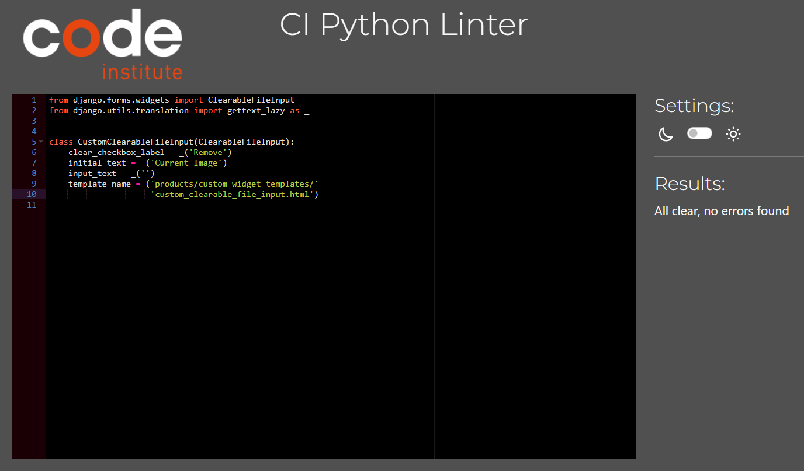
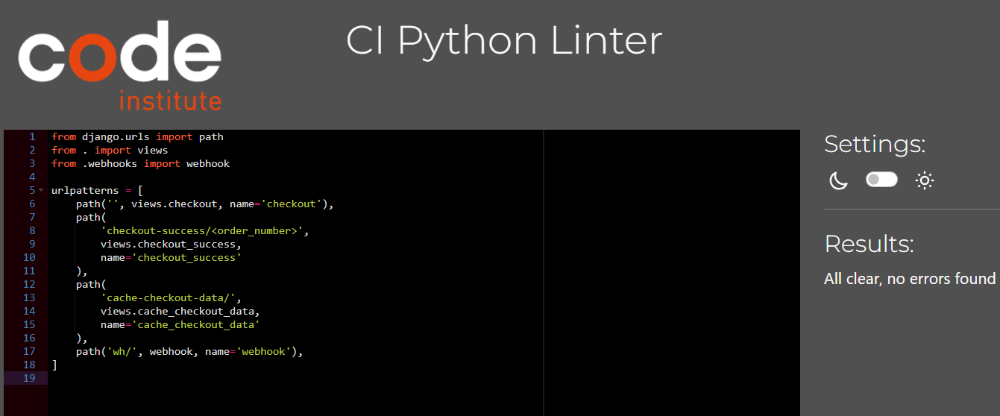

Go back to [README.md](/README.md)

#### Application is fully responsive and tested on following browsers: 
[Google Chrome](https://www.google.com/intl/en_ie/chrome/)
[Mozilla Firefox](https://www.mozilla.org/en-GB/firefox/new/)
[Microsoft edge](https://www.microsoft.com/en-gb/edge/welcome?form=MA13FJ)

Test were carried by Developer tools in the browsers as well as variaty of Mobile phones and tablets.

# Testing
- [Code Validation](#code-validation)
    - [HTML](#html)
    - [CSS](#css)
    - [JavaScript](#JavaScript)
    - [Python](#python)
- [Responsiveness](#Responsiveness)
- [Browser Compatibility](#browser-compatibility)
- [Lighthouse](#Lighthouse)
- [User Stories Testing](#user-stories-testing)
- [Bugs](#bugs)

## Code Validation
### HTML

|Page|Validator|Result|
| --- | --- | --- |
| Base | | <mark>PASS<mark> |
| Home | | <mark>PASS<mark> |
| All products | | <mark>PASS<mark> |
| Surfing Equipment | | <mark>PASS<mark> |
| Surfing Lessons | | <mark>PASS<mark> |
| Edit Item- Product Managment | | <mark>PASS<mark> |
| Surfers Profile | | <mark>PASS<mark> |
| shopping cart | | <mark>PASS<mark> |
| checkout | | <mark>PASS<mark> |
| checkout success | | <mark>PASS<mark> |

### CSS
|file|Validator|Result|
| --- | --- | --- |
| base.css | | <mark>PASS<mark> |
| checkout.css | | <mark>PASS<mark> |

## Python

|File|App|Image|Result|Comment|
| --- |----| --- | --- |----|
| admin | Product | | <mark><mark> ||
| models | Product | | <mark>PASS<mark> ||
| urls | Product | | <mark>PASS<mark> ||
| views | Product | | <mark>PASS<mark> ||
| forms | Product | | <mark>PASS<mark> ||
| widgets | Product | | <mark>PASS<mark> ||
| urls | Home | | <mark>PASS<mark> ||
| views | Home | | <mark>PASS<mark> ||
| forms | Profiles | | <mark>PASS<mark> ||
| models | Profiles | | <mark>PASS<mark> ||
| urls | Profiles | | <mark>PASS<mark> ||
| views | Profiles | | <mark>PASS<mark> ||
| admin | Checkout | | <mark>PASS<mark> ||
| apps | Checkout | | <mark>PASS<mark> ||
| forms | Checkout | | <mark>PASS<mark> ||
| models | Checkout | | <mark>PASS<mark> ||
| signals | Checkout | | <mark>PASS<mark> ||
| urls | Checkout | | <mark>PASS<mark> ||
| views | Checkout | | <mark>PASS<mark> |Line too long in code form Stripe, therefore left as is|
| webhook-handler | Checkout | | <mark>PASS<mark> |Line too long in webhooks for Stripe, therefore left as is|
| webhooks | Checkout | | <mark>PASS<mark> |2 errors in Stripe code, therefore left as is|
| contexts| Bag | | <mark>PASS<mark> ||
| urls | Bag || <mark>PASS<mark> ||
| views | Bag || <mark>PASS<mark> ||

## JavaScript
|file|Validator|Result|Comment|
| --- | --- | --- |----|
| bag | | <mark>PASS<mark> ||
| product | | <mark>PASS<mark> ||
| product | | <mark>PASS<mark> ||
| product | | <mark>PASS<mark> ||

## Stripe

- Stripe Webhooks

## Lighthouse

|Page|Validator|Result|
| --- | --- | --- |
| Home | | <mark>PASS<mark> |
| Product | | <mark>PASS<mark> |
| Checkout | | <mark>PASS<mark> |
| Checkout Sucess | | <mark>PASS<mark> |

## User Stories Testing

| User Story | Comment/Bug | Result |
|------------|-------------|--------|
| As a DEVELOPER, I need to configure the database to save my data. |  | <mark>PASS<mark> |
| As a DEVELOPER, I need to implement CRUD operations for products to manage inventory. |  | <mark>PASS<mark> |
| As a MARKETER, I want visitors to sign up for the newsletter to keep them engaged. |  | <mark>PASS<mark> |
| As a CUSTOMER, I want a website that is easy to navigate and accessible. |  | <mark>PASS<mark> |
| As a CUSTOMER, I want to view products to make purchase decisions. |  | <mark>PASS<mark> |
| As a CUSTOMER, I want the website to be responsive on mobile devices. |  | <mark>PASS<mark> |
| As a CUSTOMER, I want to securely pay for my purchases online. |  | <mark>PASS<mark> |
| As a CUSTOMER, I want the online store to reflect updates and changes immediately. |  | <mark>PASS<mark> |
| As a CUSTOMER, I want to be able to update my personal information. |  | <mark>FAIL<mark> |
| As a MARKETER, I want to showcase products and services on social media for increased visibility. |  | <mark>PASS<mark>|
| As a USER, I want to use a secure and reliable application. |  | <mark>PASS<mark> |
| As a potential CUSTOMER, I want to find the website through search engines. |  |<mark>PASS<mark> |
| As an ADMIN, I want to add, edit, and delete product listings. |  | <mark>PASS<mark> |
| As an ADMIN, I need the ability to manage customer accounts. |  | <mark>PASS<mark> |
| As an ADMIN, I want to add, update, and delete records from the database without accessing the admin panel. |  | <mark>PASS<mark> |
| As a USER, I want to register, login, logout, and manage my account. |  | <mark>FAIL<mark> |
| As a USER, I want to be able to Create, Read, and Update my profile and my shopping cart. | Problem with that from the User side, Admin side works | <mark>FAIL<mark> |
| As a DEVELOPER, I want to conduct thorough testing. |  | <mark>PASS<mark> |
| As a DEVELOPER, I need to document the project in a README. |  | <mark>PASS<mark> |
| As a STAKEHOLDER, I want to ensure the project is well documented. |  | <mark>PASS<mark> |

## Bugs

| Status | Category | Description | Comment |
|--------|----------|-------------|---------|
| ✅ | Fixed Bugs | Problems with updating and removing products from the checkout bag were addressed and resolved. | |
| ✅ | Fixed Bugs | Issue with incorrect size display in the checkout bag has been fixed. | |
| ✅ | Fixed Bugs | Updating lessons in the checkout bag now works as intended. | |
| ❌ | Known Bugs | Currently, users are unable to delete lessons from the checkout bag. | |
| ❌ | Known Bugs | Billing information is not correctly displayed on the checkout success page. | |
| ❌ | Known Bugs | Images are not displaying correctly in the view bag. | |
| ❌ | Known Bugs | Some navbar links do not work in the deployed version on Heroku. | 2 links working, the rest connected to filtering does not, links in the header work, all links in gitpod version work perfectly |
| ❌ | Known Bugs | Sign Up function for new customers is not working as expected. | |
| ❌ | Known Bugs | Email confirmations are not being sent to users upon registration. | |
| ❌ | Known Bugs | Users will be able to recover their passwords through a secure process. | |
| ❌ | Tasks | Users will have the ability to create a profile upon registration. | |
| ❌ | Tasks | Users can view their profile information. | |
| ❌ | Tasks | Users will be able to update their personal information and preferences. | |
