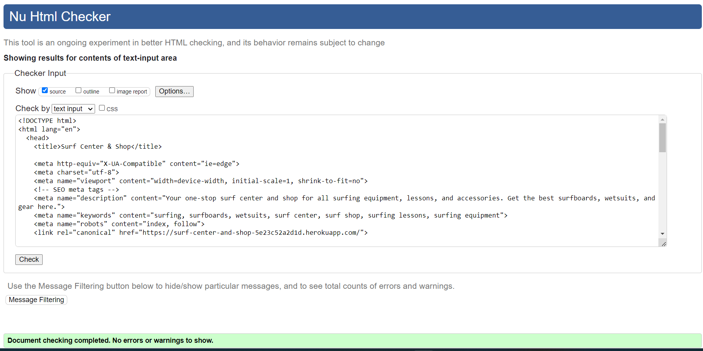

Go back to [README.md](/README.md)

#### Application is fully responsive and tested on following browsers: 
[Google Chrome](https://www.google.com/intl/en_ie/chrome/)
[Mozilla Firefox](https://www.mozilla.org/en-GB/firefox/new/)
[Microsoft edge](https://www.microsoft.com/en-gb/edge/welcome?form=MA13FJ)

Test were carried by Developer tools in the browsers as well as variaty of Mobile phones and tablets.

# Testing
- [Code Validation](#code-validation)
    - [HTML](#html)
    - [CSS](#css)
    - [JavaScript](#JavaScript)
    - [Python](#python)
- [Responsiveness](#Responsiveness)
- [Browser Compatibility](#browser-compatibility)
- [Lighthouse](#Lighthouse)
- [Manual Testing](#manual-testing)

## Code Validation
### HTML

|Page|Validator|Result|
| --- | --- | --- |
| Base | | <mark>PASS<mark> |
| Home | | <mark>PASS<mark> |
| All products | | <mark>PASS<mark> |
| Surfing Equipment | | <mark>PASS<mark> |
| Surfing Lessons | | <mark>PASS<mark> |
| Edit Item- Product Managment | | <mark>PASS<mark> |
| Surfers Profile | | <mark>PASS<mark> |
| shopping cart | | <mark>PASS<mark> |
| checkout | | <mark>PASS<mark> |
| checkout success | | <mark>PASS<mark> |

### CSS
|file|Validator|Result|
| --- | --- | --- |
| base.css | | <mark>PASS<mark> |
| checkout.css | | <mark>PASS<mark> |

## Python

|File|App|Image|Result|Comment|
| --- |----| --- | --- |----|
| admin | Product | | <mark><mark> ||
| models | Product | | <mark>PASS<mark> ||
| urls | Product | | <mark>PASS<mark> ||
| views | Product | | <mark>PASS<mark> ||
| forms | Product | | <mark>PASS<mark> ||
| widgets | Product | | <mark>PASS<mark> ||
| urls | Home | | <mark>PASS<mark> ||
| views | Home | | <mark>PASS<mark> ||
| forms | Profiles | | <mark>PASS<mark> ||
| models | Profiles | | <mark>PASS<mark> ||
| urls | Profiles | | <mark>PASS<mark> ||
| views | Profiles | | <mark>PASS<mark> ||
| admin | Checkout | | <mark>PASS<mark> ||
| apps | Checkout | | <mark>PASS<mark> ||
| forms | Checkout | | <mark>PASS<mark> ||
| models | Checkout | | <mark>PASS<mark> ||
| signals | Checkout | | <mark>PASS<mark> ||
| urls | Checkout | | <mark>PASS<mark> ||
| views | Checkout | | <mark>PASS<mark> |Line too long in code form Stripe, therefore left as is|
| webhook-handler | Checkout | | <mark>PASS<mark> |Line too long in webhooks for Stripe, therefore left as is|
| webhooks | Checkout | | <mark>PASS<mark> |2 errors in Stripe code, therefore left as is|
| contexts| Bag | | <mark>PASS<mark> ||
| urls | Bag || <mark>PASS<mark> ||
| views | Bag || <mark>PASS<mark> ||

## JavaScript
|file|Validator|Result|Comment|
| --- | --- | --- |----|
| bag | | <mark>PASS<mark> ||
| product | | <mark>PASS<mark> ||
| product | | <mark>PASS<mark> ||
| product | | <mark>PASS<mark> ||

## Stripe

- Stripe Webhooks

